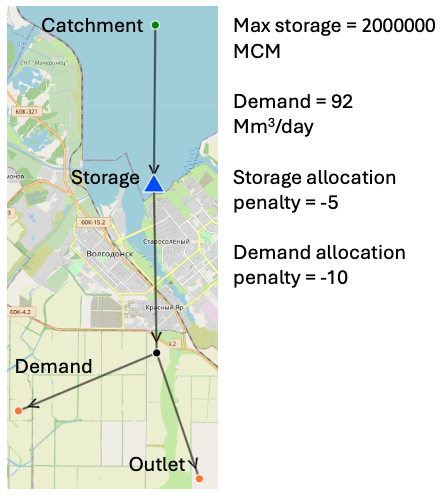
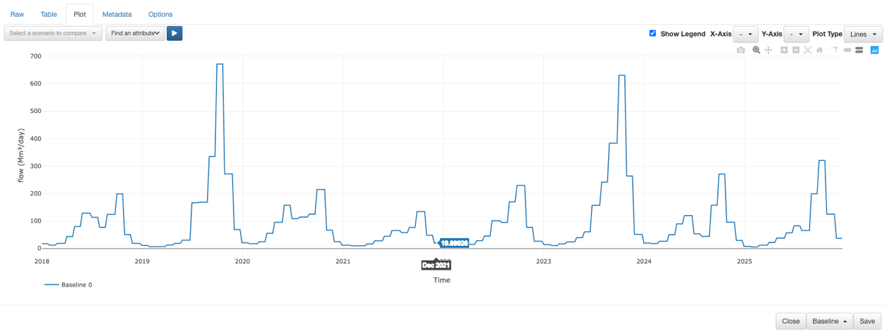
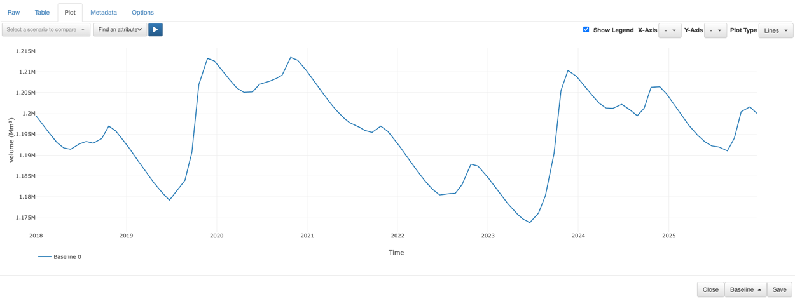
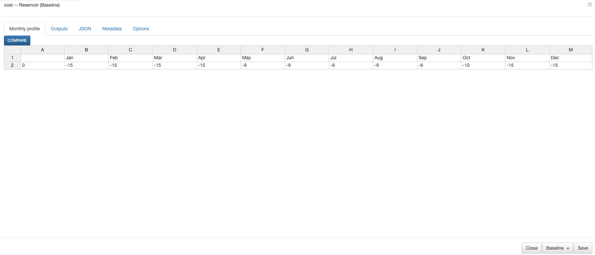
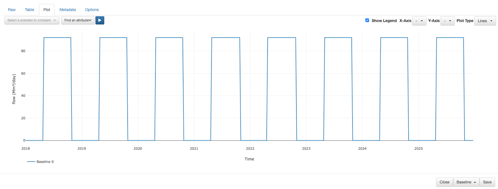
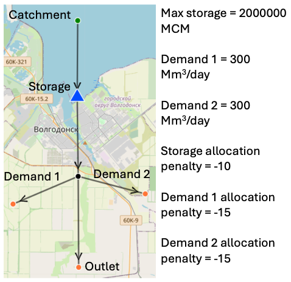
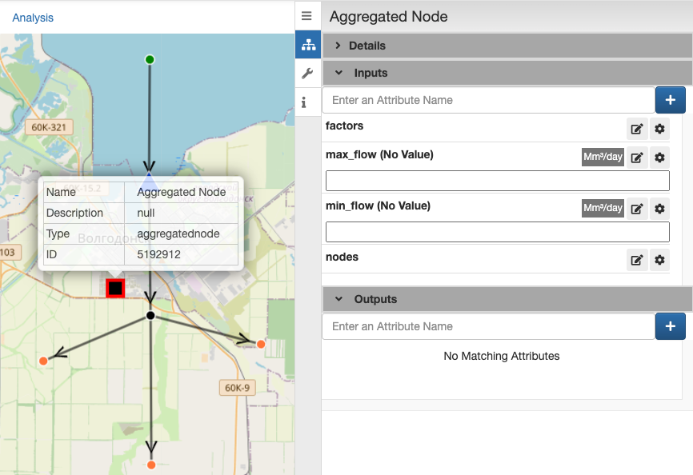
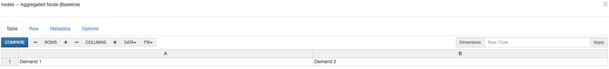
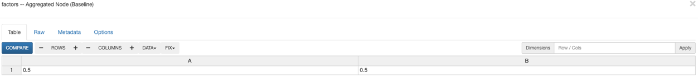
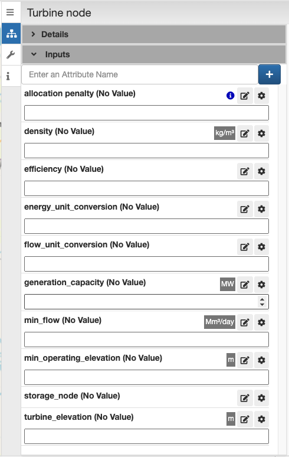

# Reservoir and Storage Nodes

### Allocation penalties on reservoirs 

Reservoir and storage nodes have allocation penalties (costs) assigned to them. A negative cost means the reservoir will accumulate water, and a positive cost instead means the reservoir will release water. The allocation penalties can be constants (constant parameters) or profiles (monthly, daily, weekly) that change based on time. Also, the allocation penalties can have different levels defined by different control curves based on the reservoir volume. Despite the reservoir and storage allocation penalties influencing water storage, releases from those nodes will result from a cost balance in the system considering allocation penalties of downstream nodes.

Following different examples are presented.

#### Constant allocation penalty

This example will use constant values as allocation penalties for different nodes in a network. Figure 1 shows a simple network comprising catchment, storage, demand, and outlet nodes.

Figure 1. Simple Pywr model implemented in WaterStrategy

The catchment node includes an inflow time series, shown in Figure 2. The maximum capacity of the storage node is 2000000 Mm3, and the demand node's demand is 92 Mm3/day.

Figure 2. Inflows time series associated with the Catchment node

This simple network has two allocation penalties for the storage and demand nodes. The allocation penalty for the storage node is -5, and the demand node is -10. Figure 3 shows the storage node's simulated volume and the demand node's resupply.

Figure 3. Simulated volume for the storage node and water supply for the demand node. Storage allocation penalty = -5, Demand allocation penalty = -10

Figure 3 shows that the 92 Mm3/day demand is always met during simulation. This is because the allocation penalty of the demand node is higher than the penalty on the storage node. Similarly, if the allocation penalty for the storage node is not set, the results will be the same as those in Figure 3. Now, if the allocation penalties are inverted, i.e., the storage allocation penalty is -10, and the demand allocation penalty is -5, the storage node will retain the water, and there will be no supply for the demand node (Figure 4).

Figure 4. Simulated volume for the storage node and water supply for the demand node. Storage allocation penalty = -10, Demand allocation penalty = -5

#### Profile allocation penalty

This example will use a monthly profile as an allocation penalty for the storage node (Figure 5) and a constant allocation penalty equal to -10 for the demand node. The network in Figure 1 will demonstrate the use of a Pywr MonthlyProfileParameter. Any other profile Pywr parameter can be used in the same way.

Figure 5. Monthly profile allocation penalty.

From May to September, the allocation penalty is lower than the penalty in the demand node, resulting in releases from the storage node only in those months to meet the demand (see Figure 6).

Figure 6. Simulated volume for the storage node and water supply for the demand node using a Monthly profile parameter

#### Nodes with equal allocation penalties

As commented in Section 1.1, allocation penalties are used to represent supply priorities in a network. In the case of water shortages and the existence of two or multiple nodes with equal priority, it is not possible to get a proportional supply using equal allocation penalties. Figure 7 shows an example of a water shortage in a network with two demand nodes with equal demand and priorities.

Figure 7. Simple Pywr model implemented in WaterStrategy with equal allocation penalties

If we run the network in Figure 7, we do not get an equal supply for nodes Demand 1 and 2 (Figure 8) because that will depend on the solver solving the water allocation problem. In the example in Figure 7, the solver allocates more water to the Demand 2 node, as seen in Figure 8.

Figure 8. Water supply to Demand nodes with equal allocation priorities.

Although using equal allocation penalties is not possible to achieve equal supply, in WaterStrategy, an “AggregatedNode” can be used to achieve the desired behaviour of getting proportional supply in the case of water shortage (see Figure 9).

Figure 9. Simple Pywr model implemented in WaterStrategy with equal allocation penalties using an “AggragtedNode”

In this case, in the “nodes” attribute of the “AggregatedNode”, the user needs to input the nodes with an equal allocation penalty and in the “factors” attribute to input the required supply proportion between the nodes, for example, for an equal supply proportion in two nodes the factors should \[0.5, 0.5], see Figure 10.

Figure 10. Nodes and Factors attribute in an Aggregated Node.

Note that the “AggregatedNode” is not connected to any node in the network (Figure 9). If we run this new network, we get an equal water supply for nodes Demand 1 and 2 (see Figure 11).

Figure 11. Water supply to Demand nodes with equal allocation priorities and an Aggregated Node.

### Hydropower plan modelling

Pywr has no explicit node to model a hydropower plant. Alternatively, users can combine a “Link” node, a Pywr parameter and a recorder to model a hydropower plant. The parameter can be a “HydropowerTargetParameter”, and the recorder a “HydropowerRecorder”. The hydropower target parameter is a parameter used to calculate the flow required to generate a particular hydropower production target. It intends to be used on a node representing a turbine where a particular production target is required each time step. The hydropower recorder calculates and saves the power production using the hydropower equation. This recorder saves an array of hydropower production in each time step. To facilitate user interaction with Pywr, WaterStrategy includes a “Turbine” node, which shows an interface (Figure 12) to input the information of the hydropower plant and internally creates a “HydropowerTargetParameter” and “HydropowerRecorder”.

Figure 12. Interface in WaterStrategy to input technical data for Turbine nodes.

Reservoir hydropower or run-of-river hydropower plants can be modelled in WaterStrategy using a “Turbine” node. The only difference is that a storage node needs to be defined for reservoir hydropower plants to account for the level variation in the reservoir for the power calculation. The head for the power calculation is calculated from the given water elevation in the “storage\_node” and “turbine\_elevation” values. If a storage node with a water elevation is given, then the head is the difference in elevation between the water and the turbine. If the water elevation parameter is “None," the head is simply the turbine elevation.
