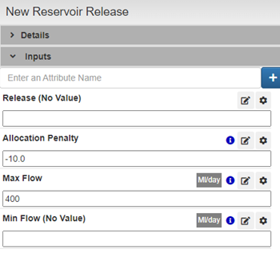

# Reading CSV DataFrame

Go to **New Reservoir Release** node and change **Max Flow** to **-400**, this will allow to flow water through this node

<figure><figcaption></figcaption></figure>

<figure><figcaption></figcaption></figure>


The downloaded file, **Thames\_Lee\_Valley\_demand.csv**, contains a time series dataset structured with two key columns:

**timestep:** This column will serve as the index for the time series. It represents the progression of time in the dataset, allowing for chronological organization.

**Lee Valley Demand:** This column contains the data representing demand values in the Lee Valley.&#x20;


<figure><figcaption><p><strong>Thames_Lee_Valley_demand</strong></p></figcaption></figure>

<figure><figcaption></figcaption></figure>

Select the output node **Lee Valley Demand** and Edit the **Max Flow**

<figure><figcaption></figcaption></figure>

In Options select **PYWR\_PARAMETER**

<figure><figcaption></figcaption></figure>

Paste the following configuration:

```json
{
	"type": "DataFrameParameter",
	"url": "Thames_Lee_Valley_demand.csv",
	"column": "Lee Valley Demand",
	"index_col": "timestep",
	"parse_dates": true
}
```

Now it should look as the following image:

<figure><figcaption></figcaption></figure>

### Results

Click on node Lee Valley Demand > Outputs > simulated\_flow to see results of the simulation

<figure><figcaption></figcaption></figure>


<figure><figcaption><p>simulated_flow (Lee Valley Demand)</p></figcaption></figure>


Now check the **simulated\_volume** for **New reservoir**

<figure><figcaption><p>simulated volume (New Reservoir)</p></figcaption></figure>
